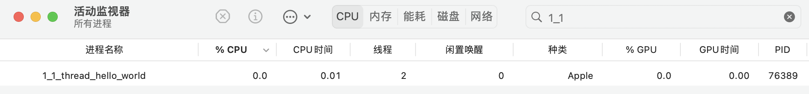
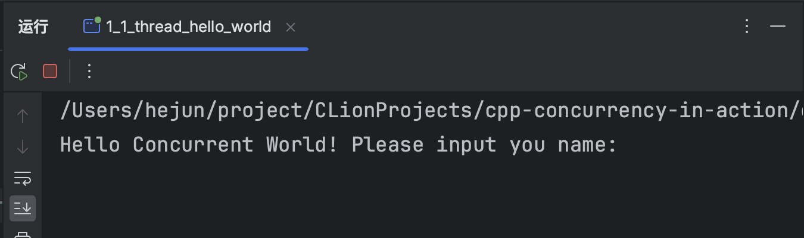
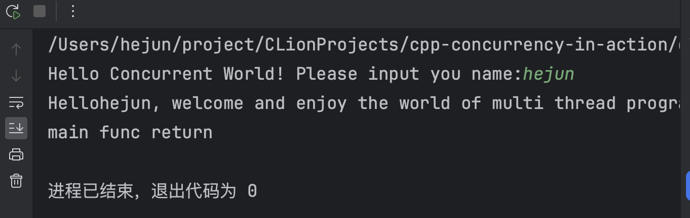
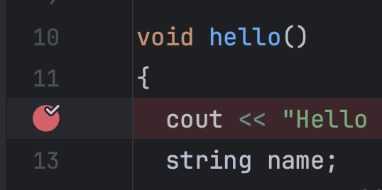
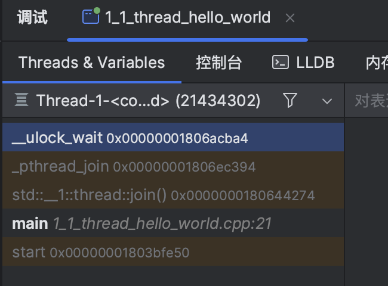
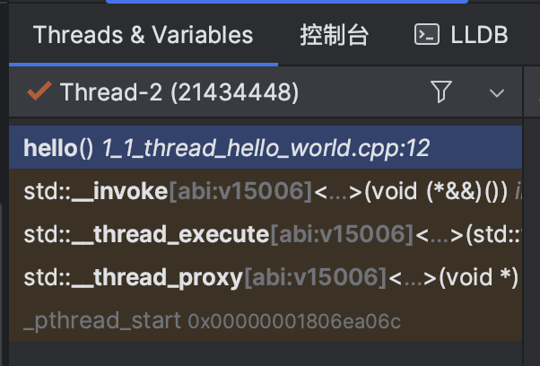

# 1. 线程基础

## 前置知识准备

如果您具有以下前置知识：

- c++基础：推荐书籍 C++ Primer Plus (第6版)

- 操作系统：推荐书籍：csapp，看自己喜好或者大学学习的操作系统书籍
  明白什么是进程
  明白什么是线程
  进程调度
  线程调度

想要学习c++并发编程，那么我们就一起学习吧
声明：本系列是本人学习《c++并发编程实践》这本书的个人总结分享，才疏学浅，如果有错误还请大家指出，分享的目的是大家一起学习，一起进步。


## 第一个c++多线程程序

src/ch1/1_1_thread_hello_world.cpp

```c++
//
// Created by 何军 on 2024/1/14.
//
#include <iostream>
#include <string>
#include <thread> // c++ 线程库，since c++11

using namespace std;

void hello()
{
  cout << "Hello Concurrent World! Please input you name:";
  string name;
  cin >> name; // 线程执行到这里时会被阻塞，因为需要等待用户输入
  cout << "Hello" << name << ", welcome and enjoy the world of multi thread programming!\n";
}

int main()
{
  std::thread t(hello); // 构造一个线程对象t，线程得到调度的时候会执行函数hello
  t.join(); // 主线程等待线程t运行结束
  cout << "main func return\n";
  return 0;
}
```

现代的操作系统通过进程来管理程序的运行，当1_1_thread_hello_world这个程序运行的时候，在操作系统中会看到一个进程，进程中会有两个线程，一个线程是以main函数作为执行入口的主线程，还有一个线程是我们代码【1】处创建的线程对象，其入口指定为hello函数。

笔者的电脑是mac，通过mac的活动监视器我们可以看到，和进程1_1_thread_hello_world关联的有两个线程



当程序运行的时候，线程t会被阻塞，因为线程t在代码【3】处等待用户输入，主线程会被阻塞，因为【2】处代码，主线程需要等待线程t执行结束。




当用户输入自己的名字之后，线程t会继续执行，线程t执行完成之后，主线程不再被代码【2】阻塞，会继续执行，最终主线程退出，进程也退出。




如果我们在hello函数打断点然后进行调试，




也会发现此时主线程执行到【2】处代码，正在等待，下图展示了主线程的函数调用栈




然后看看线程t的调用栈


